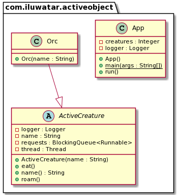

## 目的
主動式物件設計模式 (Active Object Design Pattern) 將物件的方法執行與方法呼叫脫鉤，每個物件都駐留在其自身的控制執行緒中。其目的是透過使用非同步方法呼叫和用於處理請求的排程器來引入並行性 (concurrency)。

## 解釋

實作主動式物件模式的類別將包含自我同步機制，而無需使用 synchronized 方法。

真實世界範例

>獸人以其野性和頑強的靈魂而著稱。牠們的行為似乎由一個獨立的控制執行緒所驅動，該執行緒基於先前的動作做出反應。

為了實作出一個擁有自身控制執行緒、僅公開其 API 而不暴露其執行細節的物件，我們可以使用主動式物件模式。

**程序示例**

```java
public abstract class ActiveCreature{
  private final Logger logger = LoggerFactory.getLogger(ActiveCreature.class.getName());

  private BlockingQueue<Runnable> requests;
  
  private String name;
  
  private Thread thread;

  public ActiveCreature(String name) {
    this.name = name;
    this.requests = new LinkedBlockingQueue<Runnable>();
    thread = new Thread(new Runnable() {
        @Override
        public void run() {
          while (true) {
            try {
              requests.take().run();
            } catch (InterruptedException e) { 
              logger.error(e.getMessage());
            }
          }
        }
      }
    );
    thread.start();
  }
  
  public void eat() throws InterruptedException {
    requests.put(new Runnable() {
        @Override
        public void run() { 
          logger.info("{} is eating!",name());
          logger.info("{} has finished eating!",name());
        }
      }
    );
  }

  public void roam() throws InterruptedException {
    requests.put(new Runnable() {
        @Override
        public void run() { 
          logger.info("{} has started to roam and the wastelands.",name());
        }
      }
    );
  }
  
  public String name() {
    return this.name;
  }
}
```

我們可以看到，任何繼承 ActiveCreature 的類別都將擁有自己的控制執行緒來執行和呼叫方法。

如，Orc (獸人) 類別：

```java
public class Orc extends ActiveCreature {

  public Orc(String name) {
    super(name);
  }

}
```

現在，我們可以建立多個生物 (例如獸人)，命令牠們進食和漫遊，然後牠們將在各自的控制執行緒上執行這些動作：

```java
  public static void main(String[] args) {  
    var app = new App();
    app.run();
  }
  
  @Override
  public void run() {
    ActiveCreature creature;
    try {
      for (int i = 0;i < creatures;i++) {
        creature = new Orc(Orc.class.getSimpleName().toString() + i);
        creature.eat();
        creature.roam();
      }
      Thread.sleep(1000);
    } catch (InterruptedException e) {
      logger.error(e.getMessage());
    }
    Runtime.getRuntime().exit(1);
  }
```

## 類別圖


