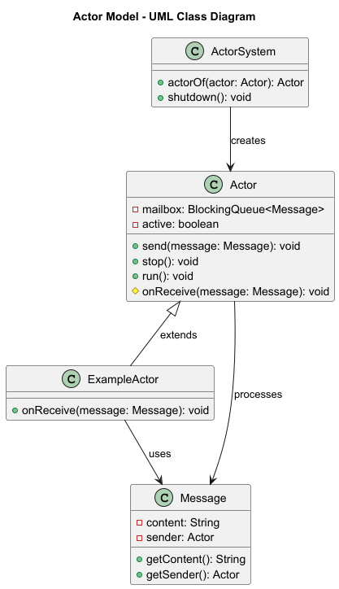

## 亦稱為

- 訊息傳遞並行 (Message-passing concurrency)

- 基於 Actor 的並行 (Actor-based concurrency)

---

## Actor Model 模式的意圖
Actor Model 模式利用隔離的元件 (actor)，透過非同步訊息傳遞進行互動，來建構高並行、分散式和容錯的系統。

---

## Actor Model 模式的詳細解釋與真實世界範例

### 📦 現實世界範例

想像一個客戶服務系統：
- 每一位 **客戶支援專員** 都是一個**actor**.
- 客戶 **傳送問題 (訊息) ** 給專員。
- 每位專員一次處理一個請求，並且能夠 **非同步地回覆** 而不會干擾到其他專員。

---

### 🧠 白話解釋

> 「Actors 就像是獨立的工人，從不共享記憶體，只透過訊息來溝通。」

---

### 📖  維基百科說

> [Actor model](https://en.wikipedia.org/wiki/Actor_model) 是一種並行運算的數學模型，將「actor」視為並行運算的普世基本元素。

---

### 🧹 架構圖



---

## Java 的 Actor Model 模式程式範例

### Actor.java

```java
public abstract class Actor implements Runnable {

    @Setter @Getter private String actorId;
    private final BlockingQueue<Message> mailbox = new LinkedBlockingQueue<>();
    private volatile boolean active = true; 


    public void send(Message message) {
        mailbox.add(message); 
    }

    public void stop() {
        active = false; 
    }

    @Override
    public void run() {
        
    }

    protected abstract void onReceive(Message message);
}

```

### Message.java

```java

@AllArgsConstructor
@Getter
@Setter
public class Message {
    private final String content;
    private final String senderId;
}
```

### ActorSystem.java

```java
public class ActorSystem {
    public void startActor(Actor actor) {
        String actorId = "actor-" + idCounter.incrementAndGet(); // Generate a new and unique ID
        actor.setActorId(actorId); // assign the actor it's ID
        actorRegister.put(actorId, actor); // Register and save the actor with it's ID
        executor.submit(actor); // Run the actor in a thread
    }
    public Actor getActorById(String actorId) {
        return actorRegister.get(actorId); //  Find by Id
    }

    public void shutdown() {
        executor.shutdownNow(); // Stop all threads
    }
}
```

### App.java

```java
public class App {
  public static void main(String[] args) {
    ActorSystem system = new ActorSystem();
      Actor srijan = new ExampleActor(system);
      Actor ansh = new ExampleActor2(system);

      system.startActor(srijan);
      system.startActor(ansh);
      ansh.send(new Message("Hello ansh", srijan.getActorId()));
      srijan.send(new Message("Hello srijan!", ansh.getActorId()));

      Thread.sleep(1000); // Give time for messages to process

      srijan.stop(); // Stop the actor gracefully
      ansh.stop();
      system.shutdown(); // Stop the actor system
  }
}
```

---

## 何時在 Java 中使用 Actor Model 模式
- 建立 **並行或分散式系統**時
- 您希望 **沒有共享的可變狀態**時
- 你需要 **非同步、訊息驅動的通訊**時
- 元件應 **隔離且鬆散耦合**

---

## Actor Model 模式的 Java 教學

- [Baeldung – Akka with Java](https://www.baeldung.com/java-akka)
- [Vaughn Vernon – Reactive Messaging Patterns](https://vaughnvernon.co/?p=1143)

---

## Actor Model 模式的真實世界應用

- [Akka 框架](https://akka.io/)
- [Erlang and Elixir concurrency](https://www.erlang.org/)
- [Microsoft Orleans](https://learn.microsoft.com/en-us/dotnet/orleans/)
- J基於 JVM 的遊戲引擎和模擬器。

---

## Actor Model 模式的優點與權衡

### ✅ 優點
- 支援高並行性。
- 易於跨執行緒或機器進行擴展。
- 容錯隔離與恢復。
- 保證 Actor 內部的訊息順序。

### ⚠️ 權衡
- 由於非同步行為，偵錯更困難。
- 由於訊息佇列，會有輕微的效能開銷。
- 設計上比簡單的方法呼叫更複雜。
---

## 相關的 Java 設計模式

- [Command Pattern](../command)
- [Mediator Pattern](../mediator)
- [Event-Driven Architecture](../event-driven-architecture)
- [Observer Pattern](../observer)

---

## 參考資料與致謝

- *Programming Erlang*, Joe Armstrong
- *Reactive Design Patterns*, Roland Kuhn
- *The Actor Model in 10 Minutes*, [InfoQ Article](https://www.infoq.com/articles/actor-model/)
- [Akka Documentation](https://doc.akka.io/docs/akka/current/index.html)

